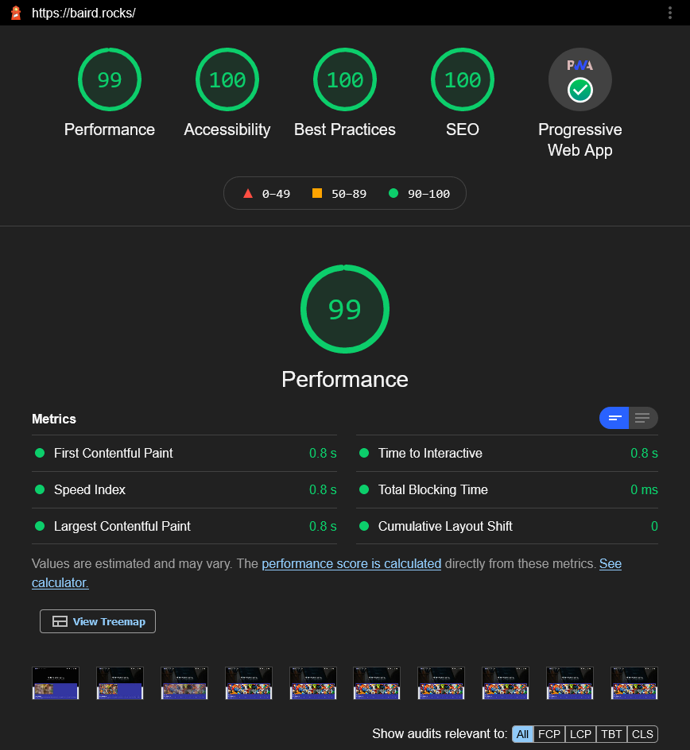

  

<h1 align="center">baird.rocks using Gatsby</h1>

  The second iteration of <a href="https://baird.rocks" target="_blank">baird.rocks</a> built with <a href="https://www.gatsbyjs.org/" target="_blank">Gatsby</a> and hosted with <a href="https://www.cloudflare.com/" target="_blank">Cloudflare</a>

  Previous iterations:
  <a href="https://github.com/MikeBairdRocks/baird.rocks.v1" target="_blank">v1</a> with <a href="https://nextjs.org/" target="_blank">NextJs</a>,

  

## ⚡ Lighthouse Score

  

I have spent time on on optimizing the website and using  capabilities to get the highest score possible in .

## 🚨 Forking this repo (please read!)

Many people have contacted me asking me if they can use this code for their own website, and the answer to that question is usually **yes, with attribution**.

So yes, you can fork this repo. Please give me proper credit by linking back to [baird.rocks](https://baird.rocks). Thanks!

Please also note that I did not build this site with the intention of it being a starter theme, so if you have questions about implementation, please refer to the [Gatsby docs](https://www.gatsbyjs.org/docs/).
