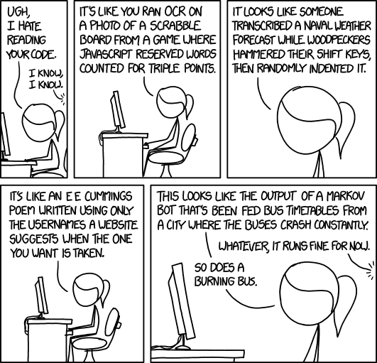

Styles guides document [coding conventions](https://en.wikipedia.org/wiki/Coding_conventions) on topics like class names, variable names and code indentation. It ensures developers write code in a consistent way, making the ability to maintain and read code easier.

When writing code, [style guides](https://en.wikipedia.org/wiki/Programming_style) reduce the number of choices a developer has to make. This allows them to focus on the program's logic instead of making style decisions. They create a consistent look to the code, so that readers can focus on content, not layout. They enable readers to understand the code more quickly by making assumptions based on previous experience. Consistently following the same naming conventions means that you don't need to look up how a property or function name is written. They facilitate copying, changing and maintaining the code.

# Adopting conventions

> The art of programming is the art of organizing complexity, of mastering multitude and avoiding its bastard chaos as effectively as possible.
> — Edsger W. Dijkstra

Conventions are nothing more than standardized work. Bad habits can be formed from various developers when writing their own style code and ignoring decades old good practices and standards, but they all have the same impact: low maintainable and error-prone code. Coding standards can help alleviate poor readability, low productivity, bugs, delays in releases and unmaintainable code. Code which is not readable is code that is more difficult to reuse, extend and evolve.

No one wants to create their own conventions and standards though unless you work for a Google or a Microsoft but luckily almost all programming languages have a consensus on what the best practices are.

Coding style is made up of numerous small decisions based on the language:

* Patterns to be used
* Patterns to be avoided
* How and when to use comments
* Tabs or spaces for indentation (and how many spaces)
* Proper naming of variables and functions

Coding styles can be extremely detailed. Here are some examples such as [Google's Style Guide](https://github.com/google/styleguide), [Microsoft's C# Style Guide](https://docs.microsoft.com/en-us/dotnet/csharp/programming-guide/inside-a-program/coding-conventions) and [Airbnb React Style Guide](https://github.com/airbnb/javascript/tree/master/react).

# It’s Personal

The personal nature of coding style is a challenge in a team atmosphere. Some see team-defined style guides as a way of forcing all developers to be the same. Some developers rebel when presented with style guides, believing that they can’t properly do their job if someone is telling them how to write their code.

I think you can relate developing software and programmers to a [concert band](https://en.wikipedia.org/wiki/Concert_band) and musicians. A band will struggle so long as every member is trying to do their own thing. It's impossible to perform great music unless everyone in the band agrees on tempo and style or you have muddle of sounds coming out. Give the musicians a band director, there music will be coordinated and sound much better.

Same holds true for software development and coding conventions. That's why I strongly recommend style guides for software development teams. By having everyone write code that looks the same, you can avoid a lot of problems down the road.

# Fixing Communication

> Programs are meant to be read by humans and only incidentally for computers to execute. — H. Abelson and G. Sussman

The most important thing when working on a team is communication. Coding standards are like speed limits: they are needed but they are useless unless they are respected. While the software your code communicates with doesn't care how the code looks, the other developers on your team certainly do. How many times have you opened up a piece of code that somebody else wrote, and, before doing anything else, re-indented it the way that you like? When everyone is writing code that looks different, everyone is constantly trying to visually parse the code before being able to understand it.

That should be enough to make developers to start thinking of their code as communication to other developers and the code should communicate its purpose to the casual observer. Your code is destined to be maintained by somebody other than you. You're communicating with members of your team in the future.

## Communication in Code Reviews

I think there are guidelines on what code review should accomplish. There are a lot of different ways to approach a code review but most code reviews should verify that the code is a correct and effective solution for the requirements at hand. When reviewing code, you should make sure that it is correct. Check that the code is bug-free, solves the intended problem and handles any edge cases appropriately. Ensure that the code is maintainable, readable and adheres to the style guide. Code reviews also increase shared knowledge of the code base and also style guide as well. This will help sharpen the team's skills through regular feedback.

## Communication in Pair Programming

[Pair programming](https://medium.com/@weblab_tech/pair-programming-guide-a76ca43ff389) is basically a growing software development technique in which two individuals work on the single block of code. The programmers undertake one of two parts — the Driver and the navigator.

The driver in the process is responsible for diligently drafting code, while the navigator’s job is to review and concentrates on the plan of action. Generally the one responsible for typing is known as the 'Driver', while the other one called the 'Navigator' continually revise and review what is being coded or typed. So coding styles can be enforced pair programming and transfer knowledge of coding conventions. The objective is to share the workload between both the participants in order to maintain the constant development stream and also to help spread knowledge over the team.

# Tools

Tools can help enforce coding style. Web developers have an unprecedented number of tools at their fingertips today. Many of them can help ensure that a coding style guide is being followed. These range from command line tools that are run as part of the build, to plugins that work with IDEs. Here are a few tools that can help keep your team on track:

* [JSHint](https://jshint.com/) A JavaScript code quality tool that also checks for stylistic issues.
* [ESLint](https://eslint.org/) A fully pluggable tool for identifying and reporting on patterns in JavaScript
* [CSSLint](https://csslint.net/) A CSS code quality tool by Nicole Sullivan and me that also checks for stylistic issues.
* [SCSSLint](https://github.com/brigade/scss-lint) Configurable tool for writing clean and consistent SCSS
* [TSLint](https://github.com/palantir/tslint) is an extensible static analysis tool that checks TypeScript code for readability, maintainability, and functionality errors
* [ReSharper](https://www.jetbrains.com/resharper/) provides on-the-fly code analysis and eliminates errors in C#, VB.NET, XAML, ASP.NET, XML.
* [StyleCop](https://github.com/DotNetAnalyzers/StyleCopAnalyzers) Analyzers an implementation of the StyleCop rules using the .NET Compiler Platform

# Conclusion

Coding style guides are an important part of writing code as a professional developer. Almost every programming language has some form of one and deciding how your code should look is an important part of overall code quality. If you don’t already have a style guide for your team or project, it’s worth the time to start one. Everyone has to buy in for it to be effective so it's important that everybody on the team participates in it's creation.